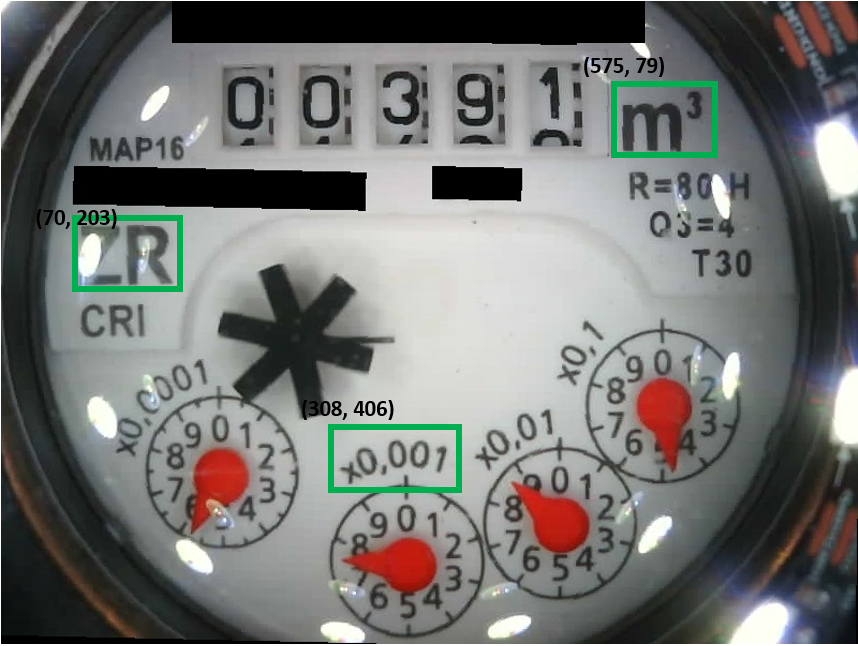
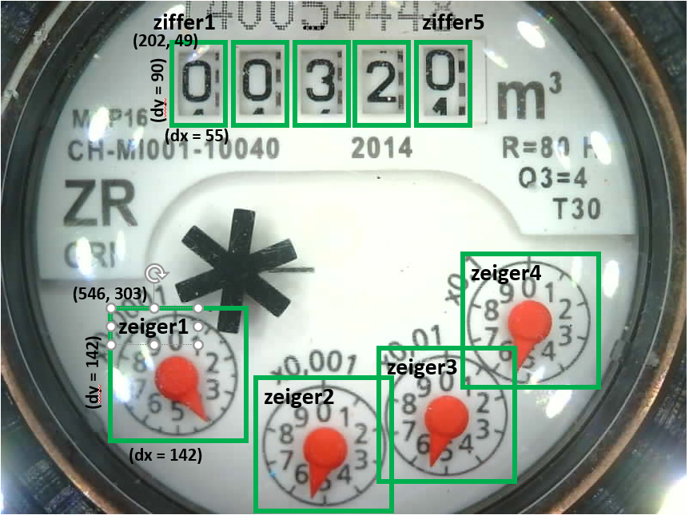
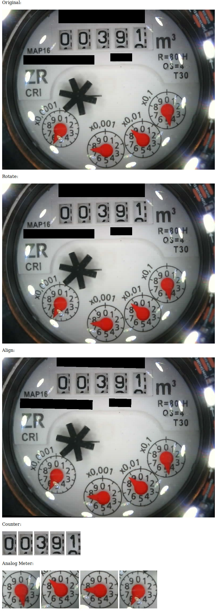

# water-meter-image-cut
 
This repository shows an option to cut an image into sub pieces, including an alignment with reference structures. The example is implemented as an HTTP-server, that takes as an input a link to an image and cuts it into previous defined parts. The information about the alignment and the parts are stored in an config file, that can be edited with any text programm.

To run the node.js code copy the whole [code](code) directory including subdirectory.

Path are relative, so it should run immediatly with the following command:
* `node water-meter-image-cut.js`

### Remarks
* Python assumes some libraries to be installed using `pip install`:
	* `opencv4nodejs`
	* `ini`
	
## Processing the image

The image processing is divided into three parts, which are explained in the following parts.

1. Prealigment 
2. Fine alignment
3. Cutting the image

### 1. Prealignment
Within the prealignment the input image can be rotated by an fixed angle. This can be used for example to correc for headlong images or 90°. The angle can be choosen arbitrary and is stored in the INI-file (see ).  

### 2. Fine Alignment
The target of this step is to bring the image into a well defined position with respect to references to align aline the image for final cutting with fixed ROIs.

This step is done using the image processing of the OpenCV library. The position of three reference structures is identified in the image and by a affine transformation the image is transformed to the final position.

As reference structures fixed structures with a high contrast are very helpfull. They need to be unique and the position should be rouhly in a triangle. The picture of the reference structures is stored in the subdirectory "reference", the position is stored in the INI-file. The position is the upper left corner in the alignet image.

Example of reference structures:

 
 
 

Structure within the image:

 

### 3. Cutting the image
Now the image is in an defined position and the ROIs can be cut and stored as individual pictures (here in the subdirectory "image_tmp").
There are two categories for the cutting:
* Analog_Counter
* Digital_Digit

In each category an arbitray number of ROIs can be defined and stored - taking into account different water meters. For each ROI a name, a position (pos_x,pos_y) and a dimension (dx, dy) must be specified.

The structure of the config.ini is described in details here: 

 

### Result

The cutout ROIs are stored in the subdirectory "image_tmp" with the corresponding name:

 
 
 
  

	
### Server Usage

To run the node.js code copy the whole [code](code) directory including subdirectory.

Path are relative, so it should run immediatly with the following command:
* `node water-meter-image-cut.js`

The server is listening to port 3000 and accepts requests in the following syntac:

http://server-ip:3000/?url=http://picture-server/image.jpg

* server-ip: address of the node-server running the script
* parameter "url": url to the picture to be analysed 

The output is the following:

   
   

